<p align="center">
  <picture>
    <source media="(prefers-color-scheme: dark)" srcset="media/header.svg">
    
  </picture>
</p>

<p align="center">
  <strong>پاس والا — "The One Nearby"</strong>
  <br>
  <em>A premium neighborhood-first social platform for Pakistan</em>
</p>

<p align="center">
  <a href="https://github.com/alynawazBaloch/PaasWala/releases/latest">
    
  </a>
  <a href="https://github.com/alynawazBaloch/PaasWala/actions">
    
  </a>
  <a href="https://github.com/alynawazBaloch/PaasWala/blob/main/LICENSE">
    
  </a>
  <a href="https://expo.dev">
    
  </a>
</p>

<p align="center">
  <a href="#-features">Features</a> •
  <a href="#-download">Download</a> •
  <a href="#-tech-stack">Tech Stack</a> •
  <a href="#-architecture">Architecture</a> •
  <a href="#-quick-start">Quick Start</a> •
  <a href="#-screenshots">Screenshots</a>
</p>

<br/>

---

## 📥 Download

<p align="center">
  <a href="https://github.com/alynawazBaloch/PaasWala/releases/latest">
    
  </a>
  <br/>
  <sub>Android 6.0+ · ~45 MB · Requires location & notification permissions</sub>
</p>

---

## ✨ Features

<table>
  <tr>
    <td width="33%" align="center">
      <h3>🏠 Community Feed</h3>
      <sub>Share posts, photos, and updates with your neighborhood — filtered by category, location, and relevance.</sub>
    </td>
    <td width="33%" align="center">
      <h3>💬 Real-time Chat</h3>
      <sub>Instant messaging with neighbors. Typing indicators, read receipts, voice notes, and message reactions.</sub>
    </td>
    <td width="33%" align="center">
      <h3>🤝 Friend & Follow</h3>
      <sub>Connect with neighbors via follow or mutual friend requests. Build your mohalla network.</sub>
    </td>
  </tr>
  <tr>
    <td width="33%" align="center">
      <h3>📍 Interactive Map</h3>
      <sub>See who's nearby, discover local spots, and view neighborhood boundaries on an emerald-themed map.</sub>
    </td>
    <td width="33%" align="center">
      <h3>🚨 Alerts</h3>
      <sub>Emergency notifications and community alerts — verified residents can send, everyone stays informed.</sub>
    </td>
    <td width="33%" align="center">
      <h3>📅 Events</h3>
      <sub>Create, discover, and RSVP to local events. From mohalla gatherings to community drives.</sub>
    </td>
  </tr>
  <tr>
    <td width="33%" align="center">
      <h3>🏪 Marketplace</h3>
      <sub>Buy, sell, and trade within your community. Local listings with in-app chat.</sub>
    </td>
    <td width="33%" align="center">
      <h3>🔍 Lost & Found</h3>
      <sub>Report lost items, help reunite them with their owners. Community-powered recovery.</sub>
    </td>
    <td width="33%" align="center">
      <h3>🏢 Business Directory</h3>
      <sub>Discover local businesses, read reviews, and get directions — support your neighborhood economy.</sub>
    </td>
  </tr>
  <tr>
    <td width="33%" align="center">
      <h3>📊 Polls</h3>
      <sub>Vote on neighborhood decisions. Anonymous or public — your mohalla, your voice.</sub>
    </td>
    <td width="33%" align="center">
      <h3>⭐ Reputation System</h3>
      <sub>Earn badges and reputation points. Bronze → Silver → Gold tiers with exclusive perks.</sub>
    </td>
    <td width="33%" align="center">
      <h3>🔐 Privacy & Security</h3>
      <sub>Granular controls: who can message you, post visibility, block users, and report abuse.</sub>
    </td>
  </tr>
</table>

---

## 🎨 UI / UX

```
✦ Premium glassmorphism design       ✦ Dark emerald theme
✦ Animated transitions & micro-interactions  ✦ Custom glow components
✦ Blur effects & frosted glass cards  ✦ Spacial audio feedback
✦ Smooth parallax & staggered lists   ✦ Haptic feedback on interactions
```

---

## 🛠️ Tech Stack

<p align="center">
  
  
  
  
  
  
  
  
</p>

| Layer | Technology | Purpose |
|-------|-----------|---------|
| **Mobile Framework** | React Native + Expo SDK 56 | Cross-platform iOS/Android |
| **Language** | TypeScript 5.7 | Type-safe, scalable codebase |
| **Authentication** | Firebase Auth (Email/OTP) | Secure user auth with AsyncStorage session persistence |
| **Database** | Cloud Firestore | Real-time NoSQL with security rules |
| **Storage** | Firebase Storage | Image & media uploads |
| **Maps & Location** | Google Maps SDK + expo-location | Interactive maps, geohashing, background location |
| **Navigation** | React Navigation 7 (Stack + Tabs) | Fade-scale transitions, deep linking |
| **Push Notifications** | Expo Notifications + FCM | Real-time push via Expo Push API |
| **Email/SMS** | Brevo API | OTP emails, transactional notifications |
| **UI** | Custom glassmorphism components | GlowButton, GlowInput, GlassCard, AvatarBadge |
| **Animations** | React Native Animated + Reanimated | Stagger lists, parallax, micro-interactions |
| **CI/CD** | EAS Build + GitHub Actions | Automated APK builds |

---

## 🏗️ Architecture

```
PaasWala/
├── src/
│   ├── components/          # Reusable UI components
│   │   ├── animated/        # StaggerList, animated transitions
│   │   ├── glass/           # GlassCard, GlowButton, GlowInput
│   │   └── shared/          # AvatarBadge, CategoryChip, OfflineBanner
│   ├── context/             # React Context providers
│   │   ├── AuthContext      # Auth state, user data, session persistence
│   │   └── LanguageContext  # Urdu/English bilingual support
│   ├── hooks/               # Custom React hooks
│   │   ├── useChat          # Real-time messaging with typing indicators
│   │   ├── useFeed          # Paginated feed with neighborhood filtering
│   │   ├── useFollow        # One-way follow system
│   │   ├── useFriends       # Two-way friend requests
│   │   └── useConnections   # Combined follow/friend queries
│   ├── navigation/          # React Navigation setup
│   │   ├── AppNavigator     # Root stack with auth gating
│   │   ├── AuthStack        # Login/Register/OTP flow
│   │   └── TabNavigator     # Main 5-tab layout
│   ├── screens/             # All screen components
│   │   ├── auth/            # Login, Register, OTP, LocationVerification
│   │   ├── feed/            # FeedScreen, PostComposer, PostDetail
│   │   ├── messages/        # ChatList, Conversation, GroupChat
│   │   ├── profile/         # Profile, Settings, Friends, Followers
│   │   ├── admin/           # AdminPanel, VerificationDetail
│   │   ├── business/        # BusinessDirectory, Detail, Create
│   │   ├── events/          # Events list, detail, create
│   │   ├── alerts/          # Alerts list, create
│   │   ├── polls/           # Polls list, create
│   │   ├── marketplace/     # Listings, detail, create
│   │   ├── lostfound/       # Lost & Found list, create
│   │   ├── search/          # Global search with 5 tabs
│   │   ├── reports/         # Report post/user screens
│   │   ├── stories/         # Story composer & viewer
│   │   ├── map/            # MapScreen, NearbyNeighbors
│   │   └── calls/          # Voice/video call screen
│   ├── services/            # Firebase, API, utilities
│   │   ├── dataService.ts   # All Firestore CRUD operations (40+ helpers)
│   │   ├── firebase.ts      # Firebase initialization
│   │   ├── notifications.ts # Push notification service
│   │   ├── location.ts      # Geo services
│   │   └── brevo.ts         # Email/SMS via Brevo
│   └── utils/               # Constants, colors, validators
├── functions/               # Firebase Cloud Functions (v2)
│   └── src/index.ts         # Auto-tasks: cleanup, reminders, stats
├── media/                   # README assets & screenshots
├── .claude/                 # Claude AI project settings
├── app.config.js            # Expo config with env mapping
├── eas.json                 # EAS Build profiles
├── firebase.json            # Firebase project config
└── firestoreRules.txt       # Firestore security rules (17+ collections)
```

---

## 📱 Screenshots

<p align="center">
  <sub>✨ Screenshots coming soon — build the APK to preview!</sub>
</p>

<!-- 
  To add screenshots:
  1. Take screenshots on your device
  2. Place them in /media/screenshots/
  3. Uncomment below:

<p align="center">
  
  
  
  
</p>
-->

---

## 🚀 Quick Start

### Prerequisites
```bash
node -v          # v18+ required
npm -v           # v9+ required
# Expo account & EAS CLI for builds
npm install -g eas-cli
eas login
```

### Setup
```bash
git clone https://github.com/alynawazBaloch/PaasWala.git
cd PaasWala
npm install

# Copy and fill in your environment variables:
# Get these from Firebase Console, Google Cloud, and Brevo dashboard
cp .env.example .env

# Start development
npx expo start
```

### Build APK
```bash
# Development build (includes expo-notifications)
eas build --platform android --profile development

# Preview APK (standalone installable)
eas build --platform android --profile preview

# Production AAB (for Play Store)
eas build --platform android --profile production
```

---

## 🔥 Firebase Cloud Functions

```bash
cd functions
npm install
npm run serve    # Local emulator
npm run deploy   # Deploy to Firebase
```

| Function | Trigger | Schedule |
|----------|---------|----------|
| `deleteExpiredStories` | Cron | Every hour |
| `deleteExpiredMessages` | Cron | Daily |
| `archiveOldLostFound` | Cron | Daily |
| `sendEventReminders` | Cron | Hourly |
| `sendExpiredPollNotification` | Cron | Hourly |
| `updateNeighborhoodStats` | Cron | Every 30 min |
| `autoHideReportedPost` | Firestore write | On report creation |
| `cleanupDeletedUserData` | Firebase Auth | On user delete |

---

## 🔒 Security

- **Firestore Security Rules** — Granular access controls for all 17+ collections
- **Block System** — Two-way block enforcement at database level
- **Verification Gating** — Unverified users see limited content
- **Rate Limiting** — Via Firebase security rules
- **Report System** — User-generated content moderation by admins

---

## 🤝 Contributing

Pull requests are welcome! For major changes, please open an issue first to discuss what you'd like to change.

1. Fork the repository
2. Create your feature branch (`git checkout -b feature/amazing-feature`)
3. Commit your changes (`git commit -m 'Add amazing feature'`)
4. Push to the branch (`git push origin feature/amazing-feature`)
5. Open a Pull Request

---

## 📄 License

**MIT License** — see [LICENSE](LICENSE) for details.

---

<p align="center">
  <strong>Apna mohalla, apni awaaz.</strong>
  <br/>
  <sub>Built with ❤️ for Pakistani neighborhoods 🇵🇰</sub>
  <br/><br/>
  <a href="https://github.com/alynawazBaloch/PaasWala">
    
  </a>
</p>
